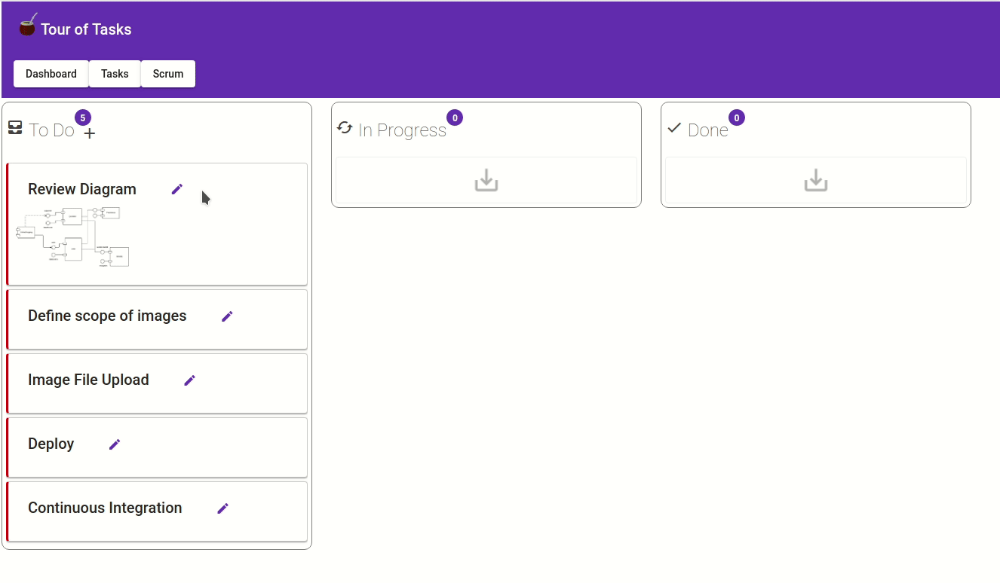
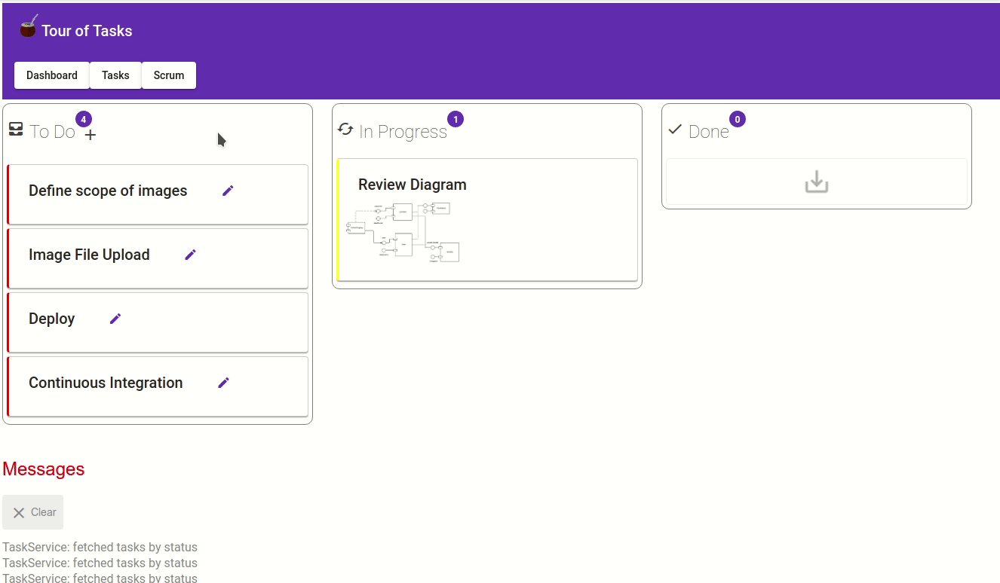
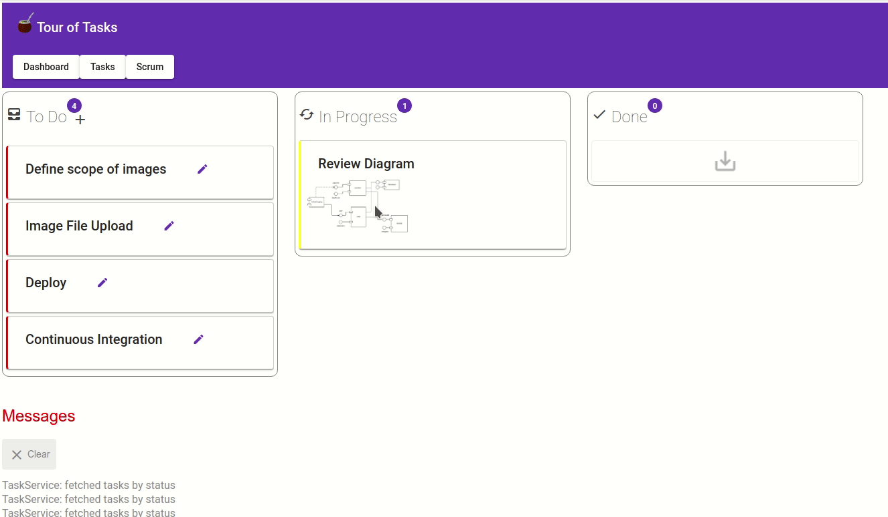

# Spring-maven-tasks
This is a demo of API and UI to manage ToDo tasks.
The objective is to show a full stack development based on Angular's example Tour of Heroes . The ui shows a dashboard called scrum, to handle the complete process of creation, edition, and change status of a To Do Task.

## Tasks Add

## Tasks Edit

## Tasks Status

## Tasks API
REST API for TODO Task CRUD.
[To see how to configure and run](tasks-api/README.md)

## Tasks UI
Angular 7 Frontend for TODO Task CRUD
[To see how to configure and run](tasks-ui/README.md)
