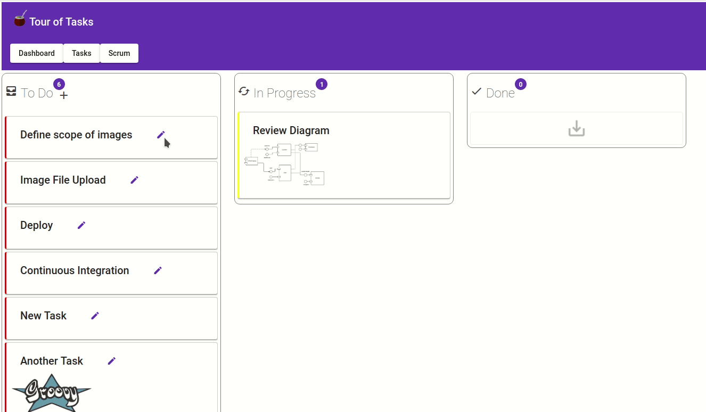

# Spring Maven Tasks
The objective of this project is to show an example of my work and highlight the technologies and concepts that I handle. All of the code and ideas have been taken from the Web and they are not innovative concepts and just been compiled here to show an integrative project.
The technologies and techniques used for this fullstack project are:
- Java
- Angular 7
- Maven (Sub projects integration, compilation, run tests)
- Spring Boot (REST API)
- Travis CI (Continuous Integration)
- Sonar Cloud ([Best Practices and Code enhancement](https://sonarcloud.io/component_measures?id=com.triadsoft:spring-maven-tasks))
- Test Driven development (TDD)
- Project statuses (badges that opens the project)

# Project Overview
This project has two parts the REST API and the Angular frontend. 
Based on the idea of the task dashboard and the Angular example Tour of Heroes the project explores some user experience concepts and tries to provide a useful user interface.
The ui shows a dashboard called scrum, to handle the complete process of creation, edition, and change status of a To Do Task.

## Tasks Add

## Tasks Edit

## Tasks Status

## Tasks API
REST API for TODO Task CRUD.
[To see how to configure and run](tasks-api/README.md)

## Tasks UI
Angular 7 Frontend for TODO Task CRUD
[To see how to configure and run](tasks-ui/README.md)
